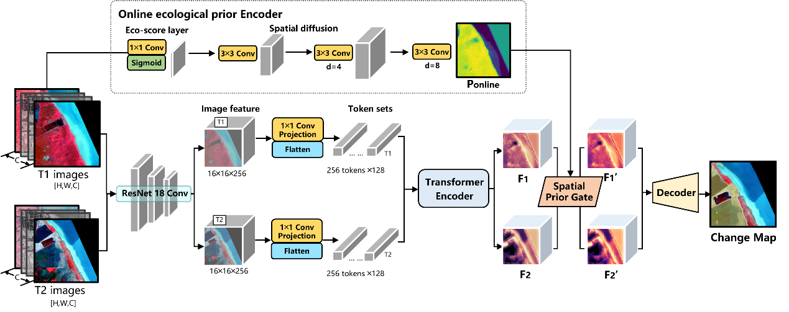
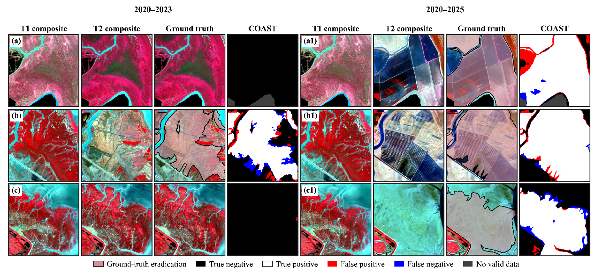

# COAST

**Online ecological-prior-guided bitemporal Transformer for mapping potential *Spartina alterniflora* eradication areas in coastal tidal flats**

COAST combines bitemporal Sentinel-2 features with an online ecological prior learned from GWDA posterior soft targets. The prior is generated from the pre-eradication image and gates the paired semantic features. A multi-scale decoder produces the change map; an auxiliary boundary head supplies supervision during training.



*Framework overview from the current manuscript.*

## Installation

Python 3.10 or newer is required. The implementation has been checked with PyTorch 2.5.1 and torchvision 0.20.1. For GPU execution, install a matching PyTorch/torchvision build for your CUDA environment from [PyTorch](https://pytorch.org/get-started/locally/) before installing the remaining requirements.

```bash
git clone https://github.com/yoyu0207/COAST.git
cd COAST
python -m pip install -r requirements.txt
```

The ResNet-18 backbone is initialized with `weights=None`: no ImageNet weights are downloaded.

## Data preparation

Prepare co-registered, 10 m resolution image patches as NumPy arrays:

```text
data/
  A/                         T1 arrays, float32 [8, 256, 256]
  B/                         T2 arrays, float32 [8, 256, 256]
  label/                     Binary reference arrays, [256, 256], values 0/1
  spatial_split_manifest.csv Spatial train/val/test assignments
  spatial_prior_gwda_oof/     Generated posterior targets for training
```

Corresponding files share a name, for example `EstuariesA_1024_2048.npy`. The final two numbers are upper-left pixel coordinates in the source raster; the preceding text identifies the source region. Labels represent **removal-related change**, not species presence/absence.

The eight channels are ordered **B8, B4, B3, B2, NDVI, EVI, SAVI, GNDVI**. Convert optical-band digital numbers to surface reflectance before computing the indices. Inputs must already be aligned and scaled; the loader applies no additional radiometric normalization.

For the original patch collection, copy the published [split manifest](splits/spatial_split_2048px_buffer256_seed42.csv) to `data/spatial_split_manifest.csv`. For a new dataset, generate a spatial split:

```bash
python -m tools.make_spatial_split --data_root data --block_size 2048 --buffer 256 --seed 42
```

The manifest records `filename, region, x, y, block_x, block_y, split`; buffered patches can be marked `excluded`. The original split contains 313 training, 59 validation and 71 test patches. Pass an existing manifest using `--split_manifest` for training/evaluation or `--manifest` for GWDA preparation.

### GWDA posterior targets

```bash
python -m tools.build_gwda_prior_oof --data_root data --sample_stride 16 --prediction_stride 16 --seed 42
```

Each training block is held out from GWDA fitting, feature standardization, bandwidth selection and isotonic calibration. Inner spatial cross-validation selects the adaptive Gaussian bandwidth by Brier score. Validation/test posterior maps are generated from training blocks only. The original dataset gives 19 outer folds.

The command saves posterior patches and fold metadata in `data/spatial_prior_gwda_oof/`. Interrupted runs can resume with unchanged inputs and settings. Use a new output directory after changing source images, labels, the manifest or GWDA settings.

**GWDA targets are used for training supervision only. Evaluation and prediction do not require posterior maps.**

## Training

```bash
python train.py --data_root data --seed 42 --epochs 200 --batch_size 8 --alpha 0.1 --spg_lr 0.0001 --boundary_weight 0.2 --amp
```

Defaults use AdamW, a base learning rate of `5e-5`, an online-prior learning rate of `5e-5`, and a gating learning rate of `1e-4`. The base loss combines BCE and Dice; posterior MSE and auxiliary boundary supervision have weights `0.1` and `0.2`. StepLR halves learning rates every 30 epochs.

Runs save `best_model.pth`, `training_log.csv`, `config.json`, `summary.json` and the split manifest under `experiments/`. Checkpoints are selected by validation F1. The default budget is 200 epochs with patience 60; `--patience 0` disables early stopping. Use `--skip_test` for validation-only configuration selection. The manuscript uses seeds **42, 1337 and 3407**.

## Evaluation and prediction

Evaluate a saved checkpoint on the fixed test split:

```bash
python evaluate.py --data_root data --checkpoint experiments/YOUR_RUN/best_model.pth --output experiments/YOUR_RUN/test_metrics.json
```

OA, Precision, Recall, F1 and IoU are computed from pooled pixel confusion counts at a default threshold of 0.5. Overlapping pixels are counted separately in their respective patches.

Predict a single aligned pair without labels or precomputed priors:

```bash
python predict.py --t1 data/A/EstuariesA_1024_2048.npy --t2 data/B/EstuariesA_1024_2048.npy --checkpoint experiments/YOUR_RUN/best_model.pth --output_dir predictions/example
```

Outputs are `change_probability.npy`, `online_prior.npy` and `change_mask.png`. This entry point handles 256 x 256 patches; it does not perform raster reprojection or full-scene mosaicking.

```python
import torch
from models import COAST

model = COAST().eval()
t1 = torch.rand(1, 8, 256, 256)
t2 = torch.rand(1, 8, 256, 256)
with torch.no_grad():
    probability = model(t1, t2).sigmoid()
```

## Example



*Cross-year examples from the current manuscript. Columns show T1, T2, reference labels and COAST predictions. White: true positive; black: true negative; red: false positive; blue: false negative; grey: invalid data.*

## Availability and checks

This repository contains the COAST implementation and spatial split metadata. Image patches, annotation datasets and trained weights are not bundled. Train a checkpoint with your prepared data before running evaluation or prediction.

```bash
python -m unittest discover -s tests -v
```

The tests cover forward/backward execution, checkpoint loading, dataset validation, spatial splitting and GWDA selection.

## Acknowledgements and license

The bitemporal Transformer design builds on [BiT](https://github.com/justchenhao/BIT_CD). The backbone uses [torchvision](https://pytorch.org/vision/stable/). See [LICENSE](LICENSE) for this repository's MIT license.
